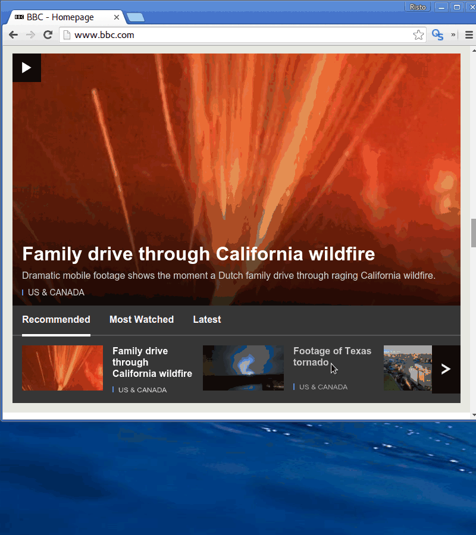

# QShot - Google Chrome extension

Capture areas in web browser quickly without using print screen and paint.



## Installation

Make sure you have Node.js v4.x at least installed to support the new V8 syntax.

Launch Development Server:
`npm run dev`

Build For Production:
`gulp build:prod`

## Demo record command

```byzanz-record -d 10 --delay=5 -x 0 -y 0 -w 800 -h 900 demo.gif```

## License

MIT
